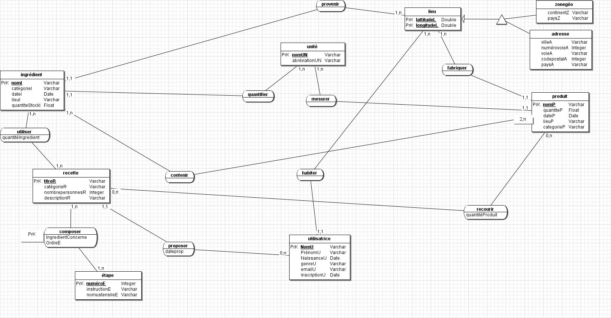

# Projet de Burdin Kevin 11507706 ainsi que de Leveque Vincent 11510244

## Importation de la base de données 

```


DROP DATABASE IF EXISTS macdoh;
CREATE DATABASE IF NOT EXISTS macdoh;
USE macdoh;
DROP TABLE IF EXISTS produit;
DROP TABLE IF EXISTS utilisatrice;
DROP TABLE IF EXISTS etape;
DROP TABLE IF EXISTS recette;
DROP TABLE IF EXISTS zonegeo;
DROP TABLE IF EXISTS adresse;
DROP TABLE IF EXISTS unite;
DROP TABLE IF EXISTS lieu;
DROP TABLE IF EXISTS ingredient;
DROP TABLE IF EXISTS contenir;
DROP TABLE IF EXISTS composer;
DROP TABLE IF EXISTS utiliser;
DROP TABLE IF EXISTS recourir;
DROP TABLE IF EXISTS fabriquer;


# Table: produit


CREATE TABLE produit(
        nomP       Varchar (100) NOT NULL ,
        quantiteP  Float ,
        dateP      Date ,
        lieuP      Varchar (100) ,
        categorieP Varchar (100) ,
        nomUN      Varchar (100) ,
        lattitudeL Double ,
        longitudeL Double ,
        PRIMARY KEY (nomP )
)ENGINE=InnoDB;


# Table: utilisatrice


CREATE TABLE utilisatrice(
        NomU         Varchar (100) NOT NULL ,
        PrenomU      Varchar (100) ,
        NaissanceU   Date ,
        genreU       Varchar (100) ,
        emailU       Varchar (100) ,
        inscriptionU Date ,
        lattitudeL   Double ,
        longitudeL   Double ,
        PRIMARY KEY (NomU )
)ENGINE=InnoDB;


# Table: étape


CREATE TABLE etape(
        numeroE       Integer NOT NULL ,
        instructionE  Varchar (100) ,
        nomustensileE Varchar (100) ,
        PRIMARY KEY (numeroE )
)ENGINE=InnoDB;


# Table: recette


CREATE TABLE recette(
        titreR           Varchar (100) NOT NULL ,
        categorieR       Varchar (100) ,
        nombrepersonnesR Integer ,
        descriptionR     Varchar (100) ,
        dateprop         Date ,
        NomU             Varchar (100) ,
        PRIMARY KEY (titreR )
)ENGINE=InnoDB;


# Table: zonegéo


CREATE TABLE zonegeo(
        continentZ Varchar (100) ,
        paysZ      Varchar (100) ,
        lattitudeL Double NOT NULL ,
        longitudeL Double NOT NULL ,
        PRIMARY KEY (lattitudeL ,longitudeL )
)ENGINE=InnoDB;


# Table: adresse


CREATE TABLE adresse(
        villeA      Varchar (100) ,
        numerovoieA Integer ,
        voieA       Varchar (100) ,
        codepostalA Integer ,
        paysA       Varchar (100) ,
        lattitudeL  Double NOT NULL ,
        longitudeL  Double NOT NULL ,
        PRIMARY KEY (lattitudeL ,longitudeL )
)ENGINE=InnoDB;


# Table: unité


CREATE TABLE unite(
        nomUN         Varchar (100) NOT NULL ,
        abreviationUN Varchar (100) ,
        PRIMARY KEY (nomUN )
)ENGINE=InnoDB;


# Table: lieu


CREATE TABLE lieu(
        lattitudeL Double NOT NULL ,
        longitudeL Double NOT NULL ,
        PRIMARY KEY (lattitudeL ,longitudeL )
)ENGINE=InnoDB;


# Table: ingrédient


CREATE TABLE ingredient(
        nomI           Varchar (100) NOT NULL ,
        categorieI     Varchar (100) ,
        dateI          Date ,
        lieuI          Varchar (100) ,
        quantiteStockI Float ,
        lattitudeL     Double ,
        longitudeL     Double ,
        nomUN          Varchar (100) ,
        PRIMARY KEY (nomI )
)ENGINE=InnoDB;


# Table: contenir


CREATE TABLE contenir(
        nomI Varchar (100) NOT NULL ,
        nomP Varchar (100) NOT NULL ,
        PRIMARY KEY (nomI ,nomP )
)ENGINE=InnoDB;


# Table: composer


CREATE TABLE composer(
        IngredientConcerne Varchar (100) NOT NULL ,
		OrdreE             Integer ,
        titreR             Varchar (100) NOT NULL ,
        numeroE            Integer NOT NULL ,
        PRIMARY KEY (titreR ,numeroE,IngredientConcerne )
)ENGINE=InnoDB;


# Table: utiliser


CREATE TABLE utiliser(
        quantiteIngredient Float ,
        nomI               Varchar (100) NOT NULL ,
        titreR             Varchar (100) NOT NULL ,
        PRIMARY KEY (nomI ,titreR )
)ENGINE=InnoDB;


# Table: recourir


CREATE TABLE recourir(
        quantiteProduit Float ,
        titreR          Varchar (100) NOT NULL ,
        nomP            Varchar (100) NOT NULL ,
        PRIMARY KEY (titreR ,nomP )
)ENGINE=InnoDB;

# Contraintes 

ALTER TABLE produit ADD CONSTRAINT FK_produit_nomUN FOREIGN KEY (nomUN) REFERENCES unite(nomUN);
ALTER TABLE produit ADD CONSTRAINT FK_produit_lattitudeL FOREIGN KEY (lattitudeL) REFERENCES lieu(lattitudeL);
ALTER TABLE produit ADD CONSTRAINT FK_produit_longitudeL FOREIGN KEY (longitudeL) REFERENCES lieu(longitudeL);
ALTER TABLE utilisatrice ADD CONSTRAINT FK_utilisatrice_lattitudeL FOREIGN KEY (lattitudeL) REFERENCES lieu(lattitudeL);
ALTER TABLE utilisatrice ADD CONSTRAINT FK_utilisatrice_longitudeL FOREIGN KEY (longitudeL) REFERENCES lieu(longitudeL);
ALTER TABLE recette ADD CONSTRAINT FK_recette_NomU FOREIGN KEY (NomU) REFERENCES utilisatrice(NomU);
ALTER TABLE zonegeo ADD CONSTRAINT FK_zonegeo_lattitudeL FOREIGN KEY (lattitudeL) REFERENCES lieu(lattitudeL);
ALTER TABLE zonegeo ADD CONSTRAINT FK_zonegeo_longitudeL FOREIGN KEY (longitudeL) REFERENCES lieu(longitudeL);
ALTER TABLE adresse ADD CONSTRAINT FK_adresse_lattitudeL FOREIGN KEY (lattitudeL) REFERENCES lieu(lattitudeL);
ALTER TABLE adresse ADD CONSTRAINT FK_adresse_longitudeL FOREIGN KEY (longitudeL) REFERENCES lieu(longitudeL);
ALTER TABLE ingredient ADD CONSTRAINT FK_ingredient_lattitudeL FOREIGN KEY (lattitudeL) REFERENCES lieu(lattitudeL);
ALTER TABLE ingredient ADD CONSTRAINT FK_ingredient_longitudeL FOREIGN KEY (longitudeL) REFERENCES lieu(longitudeL);
ALTER TABLE ingredient ADD CONSTRAINT FK_ingredient_nomUN FOREIGN KEY (nomUN) REFERENCES unite(nomUN);
ALTER TABLE contenir ADD CONSTRAINT FK_contenir_nomI FOREIGN KEY (nomI) REFERENCES ingredient(nomI);
ALTER TABLE contenir ADD CONSTRAINT FK_contenir_nomP FOREIGN KEY (nomP) REFERENCES produit(nomP);
ALTER TABLE composer ADD CONSTRAINT FK_composer_titreR FOREIGN KEY (titreR) REFERENCES recette(titreR);
ALTER TABLE composer ADD CONSTRAINT FK_composer_numeroE FOREIGN KEY (numeroE) REFERENCES etape(numeroE);
ALTER TABLE utiliser ADD CONSTRAINT FK_utiliser_nomI FOREIGN KEY (nomI) REFERENCES ingredient(nomI);
ALTER TABLE utiliser ADD CONSTRAINT FK_utiliser_titreR FOREIGN KEY (titreR) REFERENCES recette(titreR);
ALTER TABLE recourir ADD CONSTRAINT FK_recourir_titreR FOREIGN KEY (titreR) REFERENCES recette(titreR);
ALTER TABLE recourir ADD CONSTRAINT FK_recourir_nomP FOREIGN KEY (nomP) REFERENCES produit(nomP);

```

## Requetes ajout de donnees

```
#unite

INSERT INTO unite VALUES ('litre','l');
INSERT INTO unite VALUES ('piece','p');
INSERT INTO unite VALUES ('gramme','g');
INSERT INTO unite VALUES ('kilogramme','kg');
INSERT INTO unite VALUES ('cuillere a soupe','c_a_s');
INSERT INTO unite VALUES ('cuillere a cafe','c_a_c');
INSERT INTO unite VALUES ('pot de yaourt','p_d_y');
INSERT INTO unite VALUES ('tranche','tr');

#etape

INSERT INTO etape VALUES (1,'decouper','couteau'); #V
INSERT INTO etape VALUES (2,'emincer','couteau'); #V
INSERT INTO etape VALUES (3,'melanger','cuillere'); #V
INSERT INTO etape VALUES (4,'frire','poele'); #V
INSERT INTO etape VALUES (5,'petrir',NULL);
INSERT INTO etape VALUES (6,'cuire','poele'); #V
INSERT INTO etape VALUES (7,'fondre','poele');
INSERT INTO etape VALUES (8,'fouetter','fouet');
INSERT INTO etape VALUES (9,'eplucher','econome'); #V
INSERT INTO etape VALUES (10,'laver',NULL); #V
INSERT INTO etape VALUES (11,'disposer',NULL); #V
INSERT INTO etape VALUES (12,'casser',NULL); #V

#zonegeo

INSERT INTO zonegeo VALUES ('Afrique','Madagascar',-18.766947,46.869106999999985);
INSERT INTO zonegeo VALUES ('Eurasie','Russie',61.52401,105.31875600000001);
INSERT INTO zonegeo VALUES ('Afrique','Egypte',26.820553,30.802498000000014);
INSERT INTO zonegeo VALUES ('Europe','France',46.227638,2.213749000000007); 
INSERT INTO zonegeo VALUES ('Asie','Chine',35.86166000000001,104.19539699999996);
INSERT INTO zonegeo VALUES ('Asie','Coree du Nord',40.339852,127.51009299999998);
INSERT INTO zonegeo VALUES ('Amerique du Nord','USA',37.09024,-95.71289100000001); 
INSERT INTO zonegeo VALUES ('Asie','Vietnam',14.058324,108.277199);
INSERT INTO zonegeo VALUES ('Asie','Cambodge',12.565679,104.99096299999997); 
INSERT INTO zonegeo VALUES ('Asie','Espagne',40.46366700000001,-3.7492200000000366); 
INSERT INTO zonegeo VALUES ('Asie','Indonesie',-0.789275,113.92132700000002); 
INSERT INTO zonegeo VALUES ('Afrique','Algerie',28.033886,1.659626000000003); 
INSERT INTO zonegeo VALUES ('Afrique','Tunisie',33.886917,9.537499000000025); 
INSERT INTO zonegeo VALUES ('Europe','Norvege',60.47202399999999,8.46894599999996);
INSERT INTO zonegeo VALUES ('Amerique Centrale','Mexique',23.634501,-102.55278399999997);
INSERT INTO zonegeo VALUES ('Europe','Italie',41.87194,12.567379999999957);
INSERT INTO zonegeo VALUES ('Asie', 'Sri-Lanka',7.873053999999999,80.77179699999999);

#adresse

INSERT INTO adresse VALUES ('Lyon',12,'rue Garibaldi',69006,'France',45.773148,4.849781); #le macdoh
INSERT INTO adresse VALUES ('Durlinsdorf',143,'rue de Dannemarie',68480,'France',47.48620719999999,7.236671800000067); #boeuf
INSERT INTO adresse VALUES ('Rosult',344,'rue du Fayt',59230,'France',50.45886720000001,3.3651824999999462); #poulet + oeufs
INSERT INTO adresse VALUES ('Beaune',31,'Rue du Faubourg Bretonnière',21200,'France',47.0209725,4.832364299999995); #la moutarde
INSERT INTO adresse VALUES ('St-Petersbourg',15,'quai de la Moïqua',191186,'Russie',59.9342802,30.335098600000038); #Popov
INSERT INTO adresse VALUES ('Toulouse',12,"Rue du Poids de l'Huile",31000,'France',43.6040818,1.4453957000000628); #AD
INSERT INTO adresse VALUES ('Rome',5,'Viale Palmiro Togliatti',00173,'Italie',41.8529548,12.5704614); #MP
INSERT INTO adresse VALUES ('New-York',25,'Warren Street',11201,'USA',40.68904929999999,-74.00065749999999); #MJ
INSERT INTO adresse VALUES ('Francfort',42,'Berliner Street',60311,'Allemagne',50.1118144,8.681301500000018); #AZ
INSERT INTO adresse VALUES ('Springfield',742,'Evergreen Terrace',65803,'USA',37.2497715,-93.28287069999999); #Marge Simpson
INSERT INTO adresse VALUES ('Barcelone',47,'Carrer de la Canuda',08002,'Espagne',41.385056377026395,2.1734124049544334); #Los Santos
INSERT INTO adresse VALUES ('Rotterdam',4,'Aert van Nesstraat',3012,'Pays-Bas',51.9209265,4.478489699999955); #HVN
INSERT INTO adresse VALUES ('Meistratzheim',503,'Rue Hoeffen',67210,'France',48.45171209999999,7.543429100000026);#la choucroute

#lieu

INSERT INTO lieu VALUES (-18.766947,46.869106999999985);
INSERT INTO lieu VALUES (61.52401,105.31875600000001);
INSERT INTO lieu VALUES (26.820553,30.802498000000014);
INSERT INTO lieu VALUES (46.227638,2.213749000000007);
INSERT INTO lieu VALUES (35.86166000000001,104.19539699999996);
INSERT INTO lieu VALUES (40.339852,127.51009299999998);
INSERT INTO lieu VALUES (37.09024,-95.71289100000001);
INSERT INTO lieu VALUES (14.058324,108.277199);
INSERT INTO lieu VALUES (12.565679,104.99096299999997);
INSERT INTO lieu VALUES (40.46366700000001,-3.7492200000000366);
INSERT INTO lieu VALUES (-0.789275,113.92132700000002);
INSERT INTO lieu VALUES (28.033886,1.659626000000003);
INSERT INTO lieu VALUES (33.886917,9.537499000000025);
INSERT INTO lieu VALUES (60.47202399999999,8.46894599999996);
INSERT INTO lieu VALUES (45.773148,4.849781);
INSERT INTO lieu VALUES (47.48620719999999,7.236671800000067);
INSERT INTO lieu VALUES (50.45886720000001,3.3651824999999462);
INSERT INTO lieu VALUES (47.0209725,4.832364299999995);
INSERT INTO lieu VALUES (59.9342802,30.335098600000038);
INSERT INTO lieu VALUES (43.6040818,1.4453957000000628);
INSERT INTO lieu VALUES (41.8529548,12.5704614);
INSERT INTO lieu VALUES (40.68904929999999,-74.00065749999999); 
INSERT INTO lieu VALUES (50.1118144,8.681301500000018);
INSERT INTO lieu VALUES (37.2497715,-93.28287069999999);
INSERT INTO lieu VALUES (41.385056377026395,2.1734124049544334);
INSERT INTO lieu VALUES (51.9209265,4.478489699999955);
INSERT INTO lieu VALUES (23.634501,-102.55278399999997);
INSERT INTO lieu VALUES (41.87194,12.567379999999957);
INSERT INTO lieu VALUES (7.873053999999999,80.77179699999999);
INSERT INTO lieu VALUES (48.45171209999999,7.543429100000026);

#recette

INSERT INTO recette VALUES ('Zoidburger','burger',1,'Un burger qui contient du crabe avec une onctueuse tranche de tomate','2016-11-30','Simpson');  
INSERT INTO recette VALUES ('Spider-cochon','burger',1,'Tranche de jambon avec pomme de terre et oeuf coulant','2016-08-15','Daniel');
INSERT INTO recette VALUES ('Spicy Chicken','plat',4,'Des ailerons de poulets accompagnes de piments Mexicains et sa sauce harissa','2013-11-27','Los Santos');
INSERT INTO recette VALUES ('Pate Bolognaise','plat',12,'Des spagettis avec une bonne sauce tomate et des morceaux de viande de boeuf','2015-07-02','Polo');
INSERT INTO recette VALUES ('Appelflappen','dessert',1,'Un feuillete aux pommes et aux fruits confits','2013-06-07','Von Neymann');
INSERT INTO recette VALUES ('Choucroute','plat',9,'une bonne choucroute avec des saucisses de Francfort et du lard fume.','2016-12-27','Ziegler');
INSERT INTO recette VALUES ('Salade de champignons','entree',9,'une salade avec des champignons de Paris','2016-10-20','Popov');
INSERT INTO recette VALUES ('Donnut a la fraise','dessert',9,'un donnut a la fraise geant pour 9 personnes','2015-09-01','Watson');

#utilisatrice

INSERT INTO utilisatrice VALUES ('Popov','Mickahil','1970-05-06','homme','mickahil.popov@jmail.ru','2016-05-02',59.9342802,30.335098600000038);
INSERT INTO utilisatrice VALUES ('Daniel','Antoine','1986-03-08','homme','antoine.daniel@wtc.fr','2014-02-03',43.6040818,1.4453957000000628);
INSERT INTO utilisatrice VALUES ('Polo','Marco','1940-12-25','homme','m.polo@marcomail.it','2015-07-01',41.8529548,12.5704614);
INSERT INTO utilisatrice VALUES ('Watson','Mary-Jane','1982-10-24','femme','mjane@marvel.as','2015-07-01',40.68904929999999,-74.00065749999999);
INSERT INTO utilisatrice VALUES ('Ziegler','Angela','2001-01-01','femme','angelazebest@gmail.de','2016-11-27',50.1118144,8.681301500000018);
INSERT INTO utilisatrice VALUES ('Simpson','Marjorie','1976-08-11','femme','marge.bouvier@simpsmail.com','2007-08-09',37.2497715,-93.28287069999999);
INSERT INTO utilisatrice VALUES ('Los Santos','Carlos','1960-11-05','homme','lossantos.carlos@tacosmail.es','2012-04-27',41.385056377026395,2.1734124049544334);
INSERT INTO utilisatrice VALUES ('Von Neymann','Heinrich','1978-07-19','homme','heinrich.von.neymann@deutchmail.de','2013-06-05',51.9209265,4.478489699999955);

#ingredient

INSERT INTO ingredient VALUES ('oignon','legume','2016-11-25','Madagascar',5000.0,-18.766947,46.869106999999985,'piece'); #zonegeo V
INSERT INTO ingredient VALUES ('tomate','legume','2016-11-22','Russie',2500.0,61.52401,105.31875600000001,'kilogramme'); #zonegeo V
INSERT INTO ingredient VALUES ('salade','legume','2016-11-23','Egypte',200.5,26.820553,30.802498000000014,'kilogramme'); #zonegeo V
INSERT INTO ingredient VALUES ('oeufs',NULL,'2016-11-20','France',50000.0,50.45886720000001,3.3651824999999462,'piece'); #adresse V
INSERT INTO ingredient VALUES ('pomme de terre','feculent','2014-05-10','France',800.0,46.227638,2.213749000000007,'kilogramme'); #zonegeo V
INSERT INTO ingredient VALUES ('cornichon','legume','2012-12-12','France',150.0,46.227638,2.213749000000007,'gramme'); #zonegeo V
INSERT INTO ingredient VALUES ('courgette','legume','2016-11-23','France',150.0,46.227638,2.213749000000007,'kilogramme'); #zonegeo 
INSERT INTO ingredient VALUES ('pomme','fruit','2016-11-21','Chine',2000.0,35.86166,104.19539699999996,'piece'); #zonegeo V
INSERT INTO ingredient VALUES ('poire','fruit','2016-11-19','Coree du Nord',2000.0,40.339852,127.51009299999998,'piece'); #zonegeo
INSERT INTO ingredient VALUES ('fraise','fruit','2016-11-28','USA',500.0,37.7749295,-122.41941550000001,'kilogramme'); #zonegeo V
INSERT INTO ingredient VALUES ('Soja','legume','2016-11-30','Vietnam',100.0,14.058324,108.277199,'kilogramme'); #zonegeo
INSERT INTO ingredient VALUES ('riz','feculent','2016-11-23','Cambodge',200.0,12.565679,104.99096299999997,'kilogramme'); #zonegeo
INSERT INTO ingredient VALUES ('ble','cereale','2016-11-10','Espagne',400.0,40.4167754,-3.7037901999999576,'kilogramme'); #zonegeo V
INSERT INTO ingredient VALUES ('piment','epice','2010-07-29','Mexique',10.0,23.634501,-102.55278399999997,'kilogramme'); #zonegeo V
INSERT INTO ingredient VALUES ('persil','epice','2016-11-25','France',10,46.227638,2.213749000000007,'kilogramme');#zonegeo V
INSERT INTO ingredient VALUES ('coriandre','epice','2016-11-25','France',500,46.227638,2.213749000000007,'gramme');#zonegeo V
INSERT INTO ingredient VALUES ('cannelle','epice','2016-11-23','Sri-Lanka',500,7.873053999999999,80.77179699999999,'gramme');#zonegeo V
INSERT INTO ingredient VALUES ('ail','legume','2016-12-02','France',500,46.227638,2.213749000000007,'piece');#zonegeo V
INSERT INTO ingredient VALUES ('champignons','legume','2016-11-04','France',1000,46.227638,2.213749000000007,'gramme');#zonegeo V
INSERT INTO ingredient VALUES ('carotte','legume','2016-12-01','France',2000,46.227638,2.213749000000007,'gramme');#zonegeo V
INSERT INTO ingredient VALUES ('sucre','condiment','2014-12-01','France',20000,46.227638,2.213749000000007,'gramme');#zonegeo V
INSERT INTO ingredient VALUES ('navet','legume','2016-09-14','France',3000,46.227638,2.213749000000007,'gramme');#zonegeo V
INSERT INTO ingredient VALUES ('haricots verts','legume','2016-08-14','France',3000,46.227638,2.213749000000007,'gramme');#zonegeo V
INSERT INTO ingredient VALUES ('farine','cereale','2016-08-05','France',500000,46.227638,2.213749000000007,'gramme'); #zonegeo V
INSERT INTO ingredient VALUES ('levure de boulanger','levure','2016-07-19','France',100000,46.227638,2.213749000000007,'gramme'); #zonegeo V
INSERT INTO ingredient VALUES ('eau',NULL,'2016-12-03','France',NULL,46.227638,2.213749000000007,'litre'); #zonegeo V
INSERT INTO ingredient VALUES ('sel','condiment','2016-11-29','France',2000000,46.227638,2.213749000000007,'gramme'); #zonegeo V
INSERT INTO ingredient VALUES ('sarasin','cereale','2016-11-23','France',1000,46.227638,2.213749000000007,'gramme'); #zonegeo V
INSERT INTO ingredient VALUES ('noix','fruit a coque','2016-05-06','France',2000,46.227638,2.213749000000007,'gramme'); #zonegeo V
INSERT INTO ingredient VALUES ('raisins secs','fruit confit','2016-10-05','France',1000,46.227638,2.213749000000007,'gramme'); #zonegeo V
INSERT INTO ingredient VALUES ('beurre','matiere grasse','2016-11-15','France',500000,46.227638,2.213749000000007,'gramme'); #zonegeo V
INSERT INTO ingredient VALUES ('creme fraiche','laitage','2016-12-03','France',300,46.227638,2.213749000000007,'litre'); #zonegeo V
INSERT INTO ingredient VALUES ('choucroute','legume','2016-12-01','France',300,48.45171209999999,7.543429100000026,'kilogramme');#adresse V

#produit

INSERT INTO produit VALUES ('pain aux cereales',300.0,'2016-11-25','France','pain','piece',45.773148,4.849781); #adresse V
INSERT INTO produit VALUES ('pain aux noix',300.0,'2016-11-25','France','pain','piece',45.773148,4.849781); #adresse V
INSERT INTO produit VALUES ('pain nature',300.0,'2016-11-25','France','pain','piece',45.773148,4.849781); #adresse V
INSERT INTO produit VALUES ('pain aux raisins',300.0,'2016-11-25','France','pain','piece',45.773148,4.849781); #adresse
INSERT INTO produit VALUES ('pain complet',300.0,'2016-11-25','France','pain','piece',45.773148,4.849781); #adresse
INSERT INTO produit VALUES ('pate feuillete',300.0,'2016-10-24','France','pâte','piece',45.773148,4.849781); #adresse)
INSERT INTO produit VALUES ('bolognaise',20.0,'2016-11-25','France','sauce','litre',45.773148,4.849781); #adresse V
INSERT INTO produit VALUES ('ketchup',20.0,'2016-11-25','Indonesie','sauce','litre',-0.789275,113.92132700000002); #zonegeo V
INSERT INTO produit VALUES ('moutarde',20.0,'2016-11-24','France','sauce','litre',47.0209725,4.832364299999995); #adresse
INSERT INTO produit VALUES ('mayonnaise',20.0,'2016-11-22','France','sauce','litre',46.227638,2.213749000000007); #zonegeo
INSERT INTO produit VALUES ('sauce algerienne',10.0,'2016-11-25','Algerie','sauce','litre',28.033886,1.659626000000003); #zonegeo
INSERT INTO produit VALUES ('sauce blanche',10.0,'2016-11-25','France','sauce','litre',45.773148,4.849781); #adresse
INSERT INTO produit VALUES ('sauce harissa',10.0,'2016-11-25','Tunisie','sauce','litre',33.886917,9.537499000000025); #zonegeo V
INSERT INTO produit VALUES ('jambon',1000,'2016-11-23','France','viande','tranche',46.227638,2.213749000000007); #zonegeo V
INSERT INTO produit VALUES ('steak de boeuf',100.0,'2016-11-22','France','viande','kilogramme',47.48620719999999,7.236671800000067); #adresse V
INSERT INTO produit VALUES ('poulet',150.0,'2016-11-24','France','viande','kilogramme',50.45886720000001,3.3651824999999462); #adresse V
INSERT INTO produit VALUES ('lard',100.0,'2016-11-29','France','viande','kilogramme',50.45886720000001,3.3651824999999462); #adresse V
INSERT INTO produit VALUES ('saumon',200.0,'2016-11-20','Norvege','poisson','kilogramme',60.47202399999999,8.46894599999996); #zonegeo
INSERT INTO produit VALUES ('crabe',200.0,'2016-11-20','Norvege','poisson','kilogramme',60.47202399999999,8.46894599999996); #zonegeo V
INSERT INTO produit VALUES ('huile olive',20.0,'2016-11-18','France','condiment','litre',46.227638,2.213749000000007); #zonegeo
INSERT INTO produit VALUES ('pates',300.0,'2016-11-25','Italie','feculent','kilogramme',41.87194,12.567379999999957); #zonegeo V
INSERT INTO produit VALUES ('lait pasteurise',500,'2016-12-02','France','laitage','litre',46.227638,2.213749000000007); #zonegeo V

#utiliser

INSERT INTO utiliser VALUES(1,'tomate','Zoidburger');
INSERT INTO utiliser VALUES(1,'oignon','Zoidburger');
INSERT INTO utiliser VALUES(0.1,'salade','Zoidburger');
INSERT INTO utiliser VALUES(1,'cornichon','Zoidburger');
INSERT INTO utiliser VALUES(1,'tomate','Spider-cochon');
INSERT INTO utiliser VALUES(0.5,'pomme de terre','Spider-cochon');
INSERT INTO utiliser VALUES(1,'cornichon','Spider-cochon');
INSERT INTO utiliser VALUES(0.5,'pomme de terre','Spicy Chicken');
INSERT INTO utiliser VALUES(0.0001,'piment','Spicy Chicken');
INSERT INTO utiliser VALUES(1,'persil','Pate Bolognaise');
INSERT INTO utiliser VALUES(1,'coriandre','Pate Bolognaise');
INSERT INTO utiliser VALUES(2,'pomme','Appelflappen');
INSERT INTO utiliser VALUES(0.05,'sucre','Appelflappen');
INSERT INTO utiliser VALUES(0.5,'cannelle','Appelflappen');
INSERT INTO utiliser VALUES(20,'raisins secs','Appelflappen');
INSERT INTO utiliser VALUES (2,'choucroute','Choucroute');
INSERT INTO utiliser VALUES (3,'ail','Choucroute');
INSERT INTO utiliser VALUES (1,'pomme de terre','Choucroute');
INSERT INTO utiliser VALUES(2,'oignon','Choucroute');
INSERT INTO utiliser VALUES(150,'champignons','Salade de champignons');
INSERT INTO utiliser VALUES(150,'carotte','Salade de champignons');
INSERT INTO utiliser VALUES(150,'navet','Salade de champignons');
INSERT INTO utiliser VALUES(200,'haricots verts','Salade de champignons');
INSERT INTO utiliser VALUES(2,'oeufs','Donnut a la fraise');
INSERT INTO utiliser VALUES(150,'sucre','Donnut a la fraise');
INSERT INTO utiliser VALUES(0.05,'fraise','Donnut a la fraise');
INSERT INTO utiliser VALUES (150,'levure de boulanger','Donnut a la fraise');
INSERT INTO utiliser VALUES (300,'beurre','Donnut a la fraise');

#recourir

INSERT INTO recourir VALUES(1,'Zoidburger','pain aux cereales');
INSERT INTO recourir VALUES(0.01,'Zoidburger','ketchup');
INSERT INTO recourir VALUES (1,'Spider-cochon','pain nature');
INSERT INTO recourir VALUES(0.5,'Spider-cochon','jambon');
INSERT INTO recourir VALUES (0.3,'Spider-cochon','pomme de terre');
INSERT INTO recourir VALUES (1,'Spider-cochon','oeuf');
INSERT INTO recourir VALUES (0.5,'Spicy Chicken','poulet');
INSERT INTO recourir VALUES (0.01,'Spicy Chicken','sauce harissa');
INSERT INTO recourir VALUES (1,'Pate Bolognaise','bolognaise');
INSERT INTO recourir VALUES (1.5,'Pate Bolognaise','steak de boeuf');
INSERT INTO recourir VALUES (1,'Appelflappen','pate feuillete');
INSERT INTO recourir VALUES (0.5,'Choucroute','lard');
INSERT INTO recourir VALUES (3,'Salade de champignons','jambon');
INSERT INTO recourir VALUES (0.15,'Donnut a la fraise','lait pasteurise');

#contenir

INSERT INTO contenir VALUES ('ble','pain aux cereales');
INSERT INTO contenir VALUES('farine','pain aux cereales');
INSERT INTO contenir VALUES('levure de boulanger','pain aux cereales');
INSERT INTO contenir VALUES('eau','pain aux cereales');
INSERT INTO contenir VALUES('sucre','pain aux cereales');
INSERT INTO contenir VALUES('sel','pain aux cereales');
INSERT INTO contenir VALUES('sarasin','pain aux cereales');
INSERT INTO contenir VALUES('farine','pain aux noix');
INSERT INTO contenir VALUES('levure de boulanger','pain aux noix');
INSERT INTO contenir VALUES('eau','pain aux noix');
INSERT INTO contenir VALUES('sucre','pain aux noix');
INSERT INTO contenir VALUES('sel','pain aux noix');
INSERT INTO contenir VALUES('noix','pain aux noix');
INSERT INTO contenir VALUES('farine','pain nature');
INSERT INTO contenir VALUES('levure de boulanger','pain nature');
INSERT INTO contenir VALUES('eau','pain nature');
INSERT INTO contenir VALUES('sucre','pain nature');
INSERT INTO contenir VALUES('sel','pain nature');
INSERT INTO contenir VALUES('farine','pain aux raisins');
INSERT INTO contenir VALUES('levure de boulanger','pain aux raisins');
INSERT INTO contenir VALUES('eau','pain aux raisins');
INSERT INTO contenir VALUES('sucre','pain aux raisins');
INSERT INTO contenir VALUES('sel','pain aux raisins');
INSERT INTO contenir VALUES('raisins secs','pain aux raisins');
INSERT INTO contenir VALUES('farine','pain complet');
INSERT INTO contenir VALUES('levure de boulanger','pain complet');
INSERT INTO contenir VALUES('eau','pain complet');
INSERT INTO contenir VALUES('farine','pate feuillete');
INSERT INTO contenir VALUES('eau','pate feuillete');
INSERT INTO contenir VALUES('sel','pate feuillete');
INSERT INTO contenir VALUES('beurre','pate feuillete');
INSERT INTO contenir VALUES('tomate','bolognaise');
INSERT INTO contenir VALUES('persil','bolognaise');
INSERT INTO contenir VALUES('persil','sauce blanche');
INSERT INTO contenir VALUES('creme fraiche','sauce blanche');

#composer

INSERT INTO composer VALUES('pain aux cereales',1,'Zoidburger',1);#decouper
INSERT INTO composer VALUES('crabe',2,'Zoidburger',4);#frire
INSERT INTO composer VALUES('tomate',3,'Zoidburger',1);#decouper
INSERT INTO composer VALUES('oignon',4,'Zoidburger',9);#eplucher
INSERT INTO composer VALUES('oignon',5,'Zoidburger',1);#decouper
INSERT INTO composer VALUES('oignon',6,'Zoidburger',4);#frire
INSERT INTO composer VALUES('salade',7,'Zoidburger',10);#laver
INSERT INTO composer VALUES('salade',8,'Zoidburger',1);#decouper
INSERT INTO composer VALUES('crabe',9,'Zoidburger',11);#disposer
INSERT INTO composer VALUES('ketchup',10,'Zoidburger',11);#disposer
INSERT INTO composer VALUES('cornichon',11,'Zoidburger',11);#disposer
INSERT INTO composer VALUES('salade',12,'Zoidburger',11);#disposer
INSERT INTO composer VALUES('oignon',13,'Zoidburger',11);#disposer
INSERT INTO composer VALUES('pain aux cereales',14,'Zoidburger',11);#disposer
INSERT INTO composer VALUES('pain nature',1,'Spider-cochon',1);#decouper
INSERT INTO composer VALUES('pomme de terre',2,'Spider-cochon',9);#eplucher
INSERT INTO composer VALUES('pomme de terre',3,'Spider-cochon',4);#frire
INSERT INTO composer VALUES('oeuf',4,'Spider-cochon',12);#casser
INSERT INTO composer VALUES('oeuf',5,'Spider-cochon',4);#frire
INSERT INTO composer VALUES('jambon',6,'Spider-cochon',11);#disposer
INSERT INTO composer VALUES('pomme de terre',7,'Spider-cochon',11);#disposer
INSERT INTO composer VALUES('oeuf',8,'Spider-cochon',11);#disposer
INSERT INTO composer VALUES('pain nature',9,'Spider-cochon',11);#disposer
INSERT INTO composer VALUES('poulet',1,'Spicy chicken',1);#decouper
INSERT INTO composer VALUES('poulet',2,'Spicy chicken',4);#frire
INSERT INTO composer VALUES('piment',3,'Spicy chicken',2);#emincer
INSERT INTO composer VALUES('poulet',4,'Spicy chicken',11);#disposer
INSERT INTO composer VALUES('piment',5,'Spicy chicken',11);#disposer
INSERT INTO composer VALUES('pates',1,'Pate Bolognaise',6);#cuire
INSERT INTO composer VALUES('steak de boeuf',2,'Pate Bolognaise',6);#cuire
INSERT INTO composer VALUES('bolognaise',3,'Pate Bolognaise',3);#melanger
INSERT INTO composer VALUES('pates',4,'Pate Bolognaise',11);#disposer
INSERT INTO composer VALUES('steak de boeuf',5,'Pate Bolognaise',11);#disposer
INSERT INTO composer VALUES('bolognaise',6,'Pate Bolognaise',11);#disposer
INSERT INTO composer VALUES('raisins secs',1,'Appelflappen',3);#melanger
INSERT INTO composer VALUES('pomme',2,'Appelflappen',9);#eplucher
INSERT INTO composer VALUES('pomme',3,'Appelflappen',1);#decouper
INSERT INTO composer VALUES('pomme',4,'Appelflappen',11);#disposer
INSERT INTO composer VALUES('sucre',5,'Appelflappen',11);#disposer
INSERT INTO composer VALUES('cannelle',6,'Appelflappen',11);#disposer
INSERT INTO composer VALUES('pate feuillete',7,'Appelflappen',6);#cuire
INSERT INTO composer VALUES('choucroute',1,'Choucroute',10);#laver
INSERT INTO composer VALUES('choucroute',2,'Choucroute',6);#cuire
INSERT INTO composer VALUES('lard',3,'Choucroute',1);#decouper
INSERT INTO composer VALUES('lard',4,'Choucroute',6);#cuire
INSERT INTO composer VALUES('lard',5,'Choucroute',3);#melanger
INSERT INTO composer VALUES('pomme de terre',6,'Choucroute',1);#decouper
INSERT INTO composer VALUES('pomme de terre',7,'Choucroute',6);#cuire
INSERT INTO composer VALUES('pomme de terre',8,'Choucroute',3);#melanger
INSERT INTO composer VALUES('carotte',1,'Salade de champignons',9);#eplucher
INSERT INTO composer VALUES('carotte',2,'Salade de champignons',1);#decouper
INSERT INTO composer VALUES('carotte',3,'Salade de champignons',6);#cuire
INSERT INTO composer VALUES('navet',4,'Salade de champignons',9);#eplucher
INSERT INTO composer VALUES('navet',5,'Salade de champignons',1);#decouper
INSERT INTO composer VALUES('navet',6,'Salade de champignons',6);#cuire
INSERT INTO composer VALUES('haricots verts',7,'Salade de champignons',6);#cuire
INSERT INTO composer VALUES('champignons',8,'Salade de champignons',10);#laver
INSERT INTO composer VALUES('champignons',9,'Salade de champignons',2);#emincer
INSERT INTO composer VALUES('carotte',10,'Salade de champignons',3);#melanger
INSERT INTO composer VALUES('navet',11,'Salade de champignons',3);#melanger
INSERT INTO composer VALUES('haricots verts',12,'Salade de champignons',3);#melanger
INSERT INTO composer VALUES('beurre',1,'Donnut a la fraise',7);#fondre
INSERT INTO composer VALUES('beurre',2,'Donnut a la fraise',3);#melanger
INSERT INTO composer VALUES('sucre',3,'Donnut a la fraise',3);#melanger
INSERT INTO composer VALUES('oeuf',4,'Donnut a la fraise',3);#melanger
INSERT INTO composer VALUES('lait',5,'Donnut a la fraise',3);#melanger
INSERT INTO composer VALUES('farine',6,'Donnut a la fraise',3);#melanger
INSERT INTO composer VALUES('levure',7,'Donnut a la fraise',3);#melanger
INSERT INTO composer VALUES('preparation',8,'Donnut a la fraise',4);#frire
INSERT INTO composer VALUES('fraise',9,'Donnut a la fraise',11);#disposer

```

##Diagramme Entité-Association


